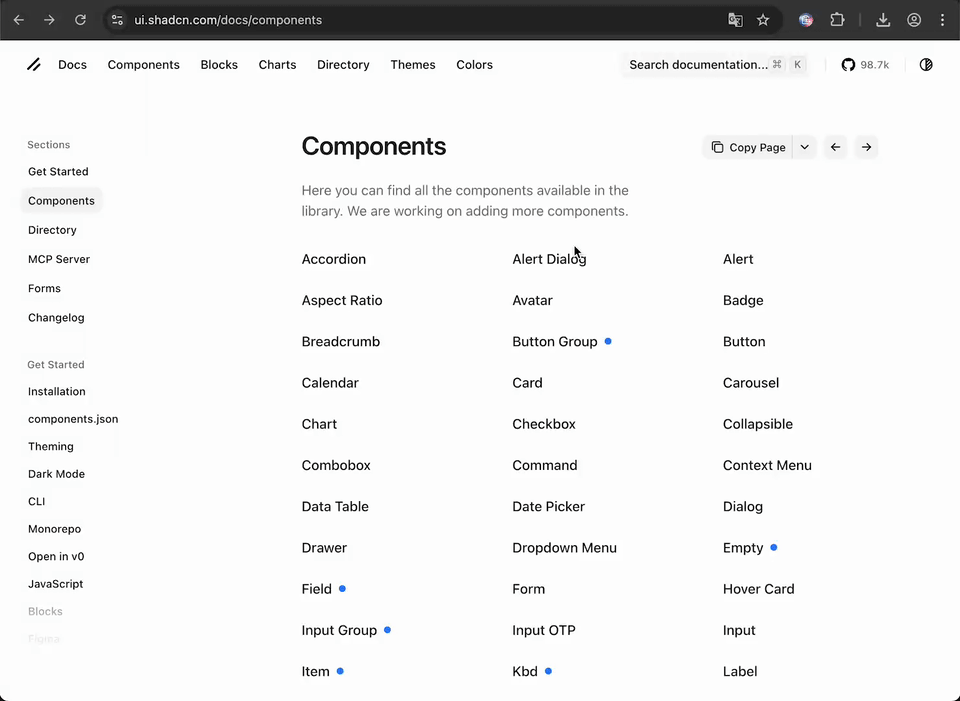

---

  <a href="./README.md">English</a> | <a href="./README-ja.md">日本語</a>

 

Tired of manually copying links one by one? Easy Link Collector is a browser extension that lets you easily collect links by simply clicking on elements displayed on web pages. Selected links are added to a side panel where you can edit them and export to clipboard, CSV, or JSON format.

## How to Use

1. **Open the Side Panel**: Click the Easy Link Collector icon in your browser toolbar.
2. **Start Collecting**: Click the toggle switch or press <kbd>Ctrl</kbd><kbd>Shift</kbd><kbd>U</kbd> / <kbd>Cmd</kbd><kbd>Shift</kbd><kbd>U</kbd> to enable element selection mode. Hover over links to see them highlighted, then click to add the target link to the side panel.
3. **Edit and Export**: Edit URLs directly in the side panel, delete individual items with the `×` button, or clear all with the trash icon. Select export formats (Clipboard, CSV, JSON) and click "Export".
4. **Stop Selection Mode**: Toggle the switch again or use the keyboard shortcut to return to normal browsing.

> [!CAUTION]
> Please note that collected links will be discarded when you close the side panel.

## Installation

> [!NOTE]
> As of 2025/11/21, this extension is not yet available on the Chrome Web Store, so you need to install it manually using Developer Mode. We will update the installation instructions once it becomes available.

**For Chrome, Edge, Brave, and other Chromium-based browsers:**

1. **Download**: Download the `easy-link-collector-extension.zip` file from the [latest release](https://github.com/peinan/easy-link-collector/releases) and unzip it.
2. **Open Extensions Page**: Navigate to `chrome://extensions` (or `edge://extensions`, `brave://extensions`).
3. **Enable Developer Mode**: Turn on the "Developer mode" toggle in the top-right corner.
4. **Load the Extension**: Click "Load unpacked" and select the unzipped `easy-link-collector-extension` folder.

The Easy Link Collector icon will appear in your browser's toolbar.

> [!CAUTION]
> Arc browser has a conflicting side panel feature that prevents this extension from working properly. We recommend using Chrome instead.

## Development & Contributing

For development setup, architecture details, debugging instructions, and contribution guidelines, see [DEVELOPMENT.md](./DEVELOPMENT.md).

## License

This project is licensed under the [MIT License](./LICENSE).
